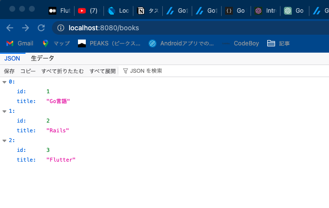

# Go言語でREST APIを作ってみた
WebフレームワークのGinと呼ばれるものを使用した
https://gin-gonic.com/ja/

まずは、プロジェクトを作る。
```
mkdir go-rest-api
cd go-rest-api
```

go.modファイルを作成する
```
go mod init example/hello
```

フレームワークを使用するパッケージを追加
```
go get -u github.com/gin-gonic/gin
```

hello.goにコードを記述する
```go
package main

import (
	"net/http"
	"github.com/gin-gonic/gin"
)

type Book struct {
	ID    int    `json:"id"`
	Title string `json:"title"`
}

var books []Book

func main() {
	books = append(books, Book{ID: 1, Title: "Go言語"})
	books = append(books, Book{ID: 2, Title: "Rails"})
	books = append(books, Book{ID: 3, Title: "Flutter"})

	r := gin.Default()

	r.GET("/books", func(c *gin.Context) {
		c.JSON(http.StatusOK, books)
	})

	r.POST("/books", func(c *gin.Context) {
		var book Book
		if err := c.BindJSON(&book); err != nil {
			c.JSON(http.StatusBadRequest, gin.H{"error": err.Error()})
			return
		}
		book.ID = books[len(books)-1].ID + 1
		books = append(books, book)
		c.JSON(http.StatusOK, book)
	})

	r.Run() // listen and serve on 0.0.0.0:8080
}
```

コンパイルするとローカルサーバーが起動する
```
go run hello.go
```

## 📡エンドポイントにアクセスする
JSONのデータがブラウザに表示されていればOK!
http://localhost:8080/books

</img>